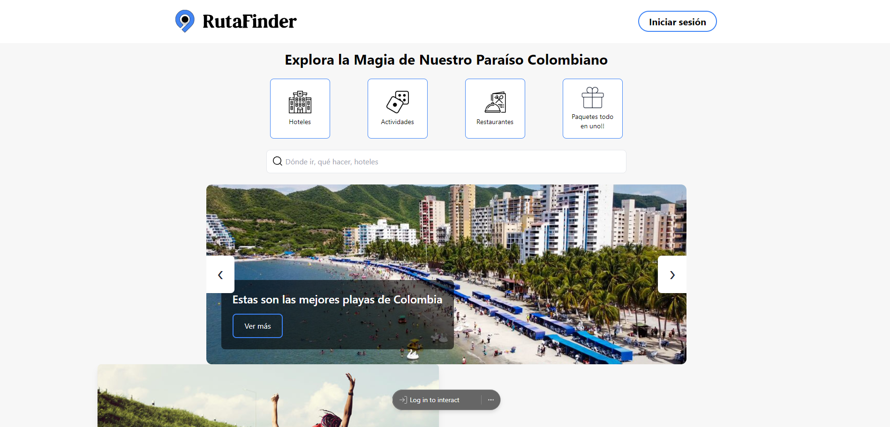

# Página Web de RutaFinder

Bienvenido al sitio web oficial de **RutaFinder**, una plataforma de viajes que ofrece una amplia variedad de destinos, actividades, hoteles, restaurantes y paquetes turísticos. Este repositorio contiene el código fuente y los archivos necesarios para desplegar la página web.

## Características de la Página Web

- **Destinos**: Explora los destinos más populares tanto nacionales como internacionales, con información detallada sobre cada ciudad y sus principales atracciones turísticas.
- **Hoteles**: Accede a una selección de los mejores hoteles en cada destino, con detalles sobre ubicación, servicios y precios.
- **Actividades**: Descubre actividades emocionantes y exclusivas para hacer en cada ciudad, desde excursiones hasta experiencias locales.
- **Restaurantes**: Encuentra los restaurantes más recomendados en cada destino, con descripciones y opiniones de los visitantes.
- **Paquetes**: Elige entre una variedad de paquetes turísticos diseñados para ofrecerte experiencias completas y cómodas en cada destino.
- **Contacto**: Si deseas más información, tienes preguntas o estás listo para reservar tu próximo viaje, ¡contáctanos fácilmente desde cualquier página del sitio!

## Tecnologías Utilizadas

La página web de **RutaFinder** está construida utilizando las siguientes tecnologías:

- [Astro](https://astro.build/): Un framework moderno para la creación de sitios web estáticos y dinámicos, ideal para generar páginas rápidas y optimizadas.
- [Tailwind CSS](https://tailwindcss.com/): Un framework de CSS utilitario para diseñar rápidamente interfaces de usuario con un enfoque en la personalización y la eficiencia.
- [JavaScript](https://developer.mozilla.org/es/docs/Web/JavaScript): Se utilizó JavaScript para agregar interactividad y funcionalidades dinámicas en la plataforma.
- [Vite](https://vitejs.dev/): Herramienta de construcción rápida y optimizada para el desarrollo de sitios web modernos.
- [Markdown](https://www.markdownguide.org/): Usado para la documentación y las descripciones dinámicas en el sitio.

## Cómo Contribuir

¡Nos encantaría recibir contribuciones para mejorar el sitio web de **RutaFinder**! Si tienes alguna sugerencia para nuevas características, mejoras en el diseño, correcciones de errores, o cualquier otra idea, no dudes en enviar una solicitud de extracción (pull request).

### Pasos para contribuir:

1. Haz un fork del repositorio.
2. Crea una nueva rama para tu funcionalidad (`git checkout -b feature/nueva-caracteristica`).
3. Realiza tus cambios y haz commit de ellos (`git commit -m 'Añadir nueva funcionalidad'`).
4. Envía un pull request.

## Despliegue

Puedes desplegar esta página web en tu propio servidor o utilizar servicios de hosting como **GitHub Pages**, **Netlify**, o **Vercel**. Sigue las instrucciones a continuación para hacer el despliegue en tu entorno de preferencia:

1. Clona este repositorio: `git clone https://github.com/tu-usuario/rutafinder.git`
2. Instala las dependencias: `npm install`
3. Construye el proyecto: `npm run build`
4. Despliega los archivos generados en la carpeta `dist/` a tu servidor o servicio de hosting preferido.

## Autor

Este proyecto fue desarrollado por **[Samuel Bautista alvarado, Sebastian Sanchez Serna y Jeison Javier Ramirez]**.

---

¡Gracias por visitar el sitio web de **RutaFinder**! Si tienes alguna pregunta o comentario, no dudes en ponerte en contacto con nosotros a través de las opciones de contacto disponibles en el sitio web.
